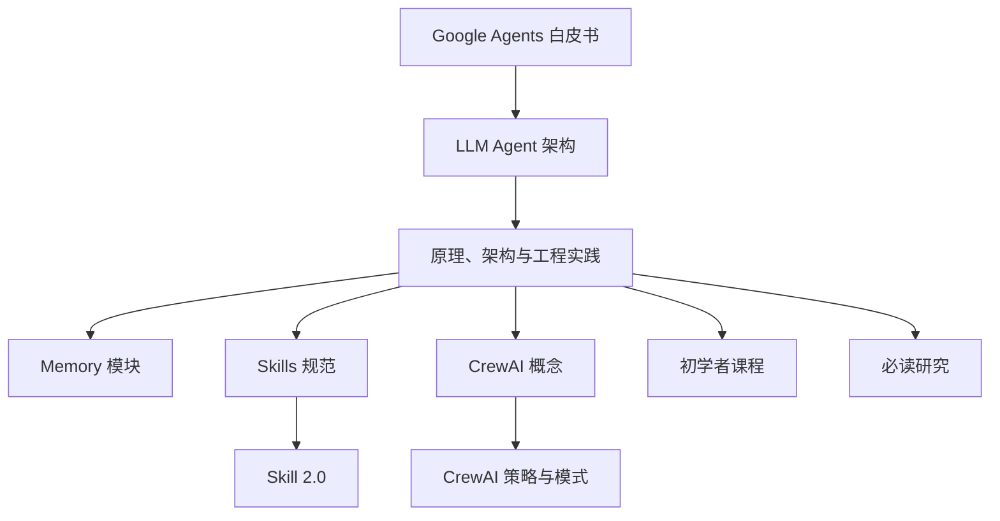

Agent 专题：从白皮书和架构出发，到 Memory、Skills、CrewAI 工程实践，再接到课程与论文。图谱表示推荐阅读路径，点下方标题进入文章。

## 学习路径

```mermaid
flowchart TD
  WP["Google Agents 白皮书"] --> ARCH["LLM Agent 架构"]
  ARCH --> PRIN["原理、架构与工程实践"]
  PRIN --> MEM["Memory 模块"]
  PRIN --> SK["Skills 规范"]
  SK --> SK2["Skill 2.0"]
  PRIN --> CREW["CrewAI 概念"]
  CREW --> PROC["CrewAI 策略与模式"]
  PRIN --> COURSE["初学者课程"]
  PRIN --> PAPERS["必读研究"]
```

## 文章



